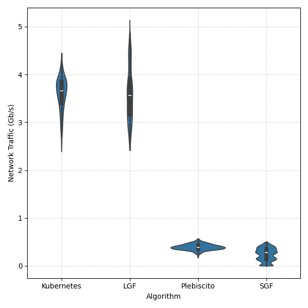
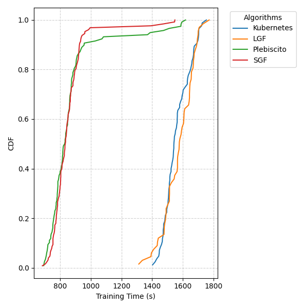
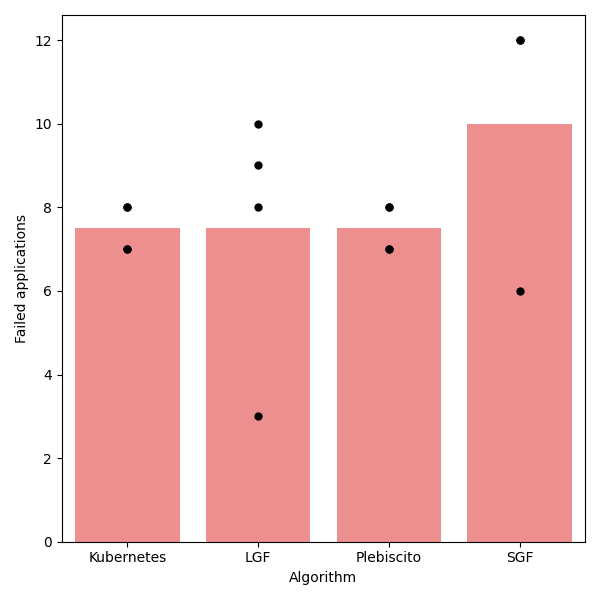

# Test setup

 - 7 servers
   - 4 server host workloads
   - 2 leaf servers for networking 
   - 1 spine server
 - 30 applications submitted
   - Each with 1 PS and 5 workers, each requiring 0.1 CPU cores
   - Part of the communication will go through the NIC, some other in localhost, depending on the allocation

# Traffic throught the server physical network card

The following plots represent the received/transmitted traffic through the servers' network interface (the lower the better). 

Received Traffic            |  Transmitted Traffic
:-------------------------:|:-------------------------:
  |  

# Traffic throught localhost

Similar to the previous one but complementing the previous results with an insight of the remaining thraffic forwarded through localhost. 

Received Traffic            |  Transmitted Traffic
:-------------------------:|:-------------------------:
  |  

# Training time

The following plot represent the training time required by the applications deployed.

# Failure resiliency

Apparently, SGF experiences similar results. In order to evaluate which is better, let's focus on the resiliency to failures.
Specifically, what happens if one of the servers unexpectly goes down, how would that compromise the execution of the applications deployed.
We consider the execution of an application to be compromized if the server in which the PS is executing goes down. 
The following figure represents how many applications will be affected if a random server in the infrastructure goes down.
Since SGF basically performs bin packing, we can clearly see that in the worst case more applications are are affected by a possible failure.

